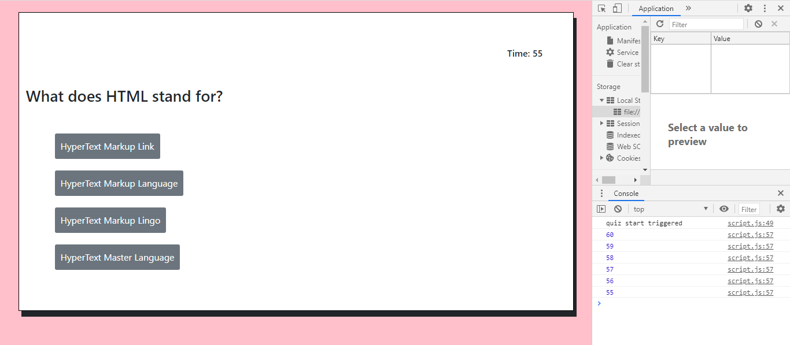

# Week-5-Coding-Quiz
### Description
In this project, I created a Coding Quiz app using DOM manipulation in JavaScript! This coding quiz was extremely challenging, as at first I was lost as to where to even begin. In completing this Coding Quiz, I've gotten a lot more practice with writing functions and have learned different ways in making web pages even MORE interactive with JavaScript. Hope you enjoy!

---

### Table of Contents
* [Installation](#Installation) 
* [Usage](#Usage)  
* [Credits](#Credits)  
* [Badges](#Badges)  
* [License](#License)

---

### Installation 
<a href = "https://mbennett1991.github.io/Week-5-Coding-Quiz/">Click me</a> to test your knowledge in a timed quiz! 
  
<small><b>Pro-Tip:</b> The last question is a trick question!</small>

---

### Usage  
To further show the interactive-ness of the Coding Quiz I have included screenshots to show the various pages created for the web page. 

---

### Links
Below is a link to my gitHub pages to see more of my work!

<a href = "https://mbennett1991.github.io/">Click me</a>
 
---
  
### Credits
@ChiggyO

---

### Badges 

---

### License 
© 2020 Trilogy Education Services, a 2U, Inc. brand. All Rights Reserved.